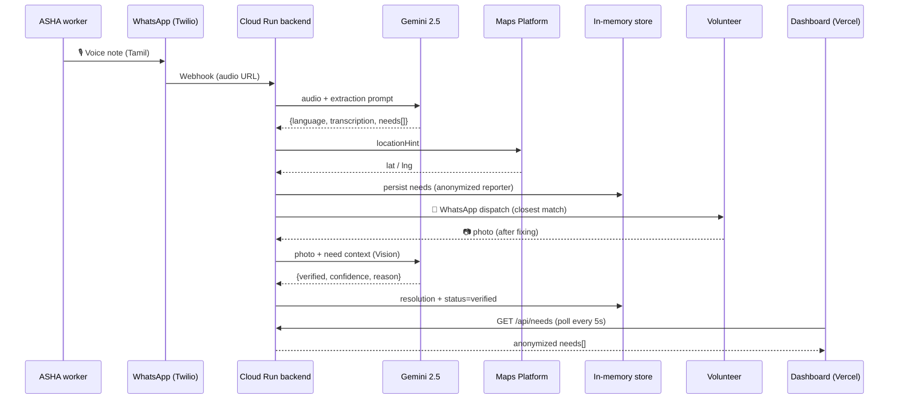

<div align="center">

# SAHAYA · सहाय · சகாயம்

### Voice-first community needs intelligence

**Turning ASHA worker voice notes into NGO action — over WhatsApp.**

[](LICENSE)
[](https://ai.google.dev)
[](https://cloud.google.com/run)
[](https://developers.google.com/maps)
[](https://nextjs.org)
[](https://vercel.com)

🏆 Built for **Google Solution Challenge 2026** · GDG on Campus — Coimbatore Institute of Technology

</div>

---

## The problem

India has **1.04 million ASHA workers**¹ — frontline community health activists, mostly women, who walk villages every day and witness 30+ unmet community needs: a child with a rash, a dry tube well, a grandmother who hasn't eaten in two days. Today they can report **2 of those 30**, because the reporting tools are paper forms and English smartphone apps that assume a literacy and digital fluency they may not have.

Meanwhile, NGOs and local-government volunteers sit hours away with skills and willingness to help — but no live signal of what's needed where.

> ¹ National Health Mission, 2024.

## The idea — five ingredients no one else combines

1. **Voice-first.** ASHA workers speak 20-second voice notes in their own language.
2. **WhatsApp-native.** No app to install. Both intake AND dispatch happen on the one app every Indian phone already has.
3. **Multilingual at the model layer.** Tamil, Hindi, English (or code-mix) — Gemini 2.5 handles all of them in a single call.
4. **Closed-loop, with proof.** Volunteers send a "fixed it" photo. Gemini Vision compares it to the reported issue and returns `verified | confidence | reason`.
5. **Public ledger.** A live Google Maps heatmap of every need, every resolution, every photo — readable by any citizen, journalist, or policy maker.

## How it works



## ✨ Highlights

- 🎙️ **Single-API multimodal**: one Gemini 2.5 Flash call does language detection + transcription + structured extraction
- 🛡️ **Privacy by API**: phone numbers never leave the backend's `asha_workers` / `volunteers` maps. The public REST API only emits an opaque `publicId` and a first name.
- 🇮🇳 **Three Google products** end-to-end: **Gemini · Cloud Run · Google Maps Platform**
- 🗺️ **Coimbatore-region demo data**: 47 needs across 5 villages (Pollachi, Sulur, Annur, Mettupalayam, Karamadai) in Tamil/Hindi/English, seeded automatically on every cold start
- ✅ **Closed-loop verification**: every resolved need on the dashboard has a Gemini-verified photo
- 📵 **Zero install**: ASHA workers and volunteers both interact entirely through WhatsApp
- 🪶 **No external database**: purpose-built in-memory store seeded at startup. Trade-off documented; production swap is a one-file change.

## Why no database?

This build deliberately avoids Firebase / Firestore / Postgres / etc. The data model lives in a single in-memory store (`backend/src/lib/store.ts`) seeded on every process start with the 47 demo needs. Real WhatsApp inbound writes accumulate during the lifetime of the Cloud Run instance.

**Operational implications:**
- Cloud Run with `min-instances=1` recommended for live demos so accumulated state survives idle gaps
- Demo data is always present (re-seeds on cold start)
- Production deployments swap `lib/store.ts` for a Postgres or Cloud SQL adapter — every other layer stays the same

The reason: a hackathon judge can read the entire data layer in under 200 lines. No vendor lock-in, no schema migrations, no auth keys to leak.

## SDG alignment

| Goal | How SAHAYA contributes |
|---|---|
| **SDG 1** No Poverty | Routes food, ration, and shelter needs to the nearest qualified volunteer within hours |
| **SDG 3** Good Health & Well-being | PHC stockouts, antenatal lapses, TB medicine gaps surfaced and dispatched |
| **SDG 5** Gender Equality | The reporter network (ASHA) is 100% women; voice-first removes the literacy barrier |
| **SDG 10** Reduced Inequalities | Public dashboard creates accountability across rural / urban divide |
| **SDG 11** Sustainable Communities | Maps community needs spatially for evidence-based local planning |

[Detailed SDG mapping →](docs/SDG_ALIGNMENT.md)

## Stack

| Layer | Tech | Google? |
|---|---|---|
| AI — voice + vision | **Gemini 2.5 Flash** | ✅ |
| Backend | **Cloud Run** (Node 22 + TypeScript + Express) | ✅ |
| Maps + geocoding | **Google Maps Platform** | ✅ |
| Data | In-memory store (auto-seeded) | — |
| Photo storage | Twilio media URL + backend proxy (`/media/:id`) | — |
| Frontend | Next.js 15 + Tailwind 3 + React 19 | — |
| Web hosting | Vercel | — |
| Messaging | WhatsApp via Twilio | — |

## Repository layout

```
SAHAYA/
├── backend/                    Cloud Run service
│   └── src/
│       ├── lib/                config, logger, twilio, twilioOutbound, maps, geo, store, seedRunner
│       ├── domain/             types (Zod), repo (in-memory CRUD)
│       ├── pipeline/           extractNeeds, geocode, processNeeds, dispatchVolunteer, verifyResolution, volunteerCommands
│       ├── routes/             health, whatsapp, api, media, test
│       └── scripts/            seedData (47 needs · 10 volunteers · 5 villages)
├── web/                        Next.js 15 dashboard
│   ├── app/                    layout, page, globals.css
│   ├── components/             Header, HeroStrip, NeedsMap, ActivityFeed, NeedCard, NeedTypeBreakdown
│   └── lib/                    api (fetch helpers), useNeeds (poll hook), types
├── scripts/                    deploy-{backend,web,all}.sh
├── docs/
│   ├── SETUP.md                Fetch the 3 API keys (Gemini · Maps · Twilio)
│   ├── DEPLOY.md               Cloud Run + Vercel runbook
│   ├── ARCHITECTURE.md         System flow + design decisions
│   ├── DATA_MODEL.md           In-memory data model + privacy posture
│   ├── SDG_ALIGNMENT.md        Detailed UN SDG mapping
│   ├── VIDEO_SCRIPT.md         3-min demo video shot list + voiceover
│   └── SUBMISSION.md           Hack2Skill submission text
├── LICENSE
└── README.md
```

## Quickstart

### Local dev

```bash
git clone https://github.com/Mithran-MV/SAHAYA.git && cd SAHAYA

# Backend
cd backend
cp .env.example .env             # see docs/SETUP.md for keys
npm install
npm run dev                      # http://localhost:8080  (auto-seeds 47 needs)

# Web (in another terminal)
cd ../web
cp .env.local.example .env.local
npm install
npm run dev                      # http://localhost:3000  (polls backend every 5s)
```

That's it. Open `http://localhost:3000` and the dashboard is alive with the demo dataset.

### Deploy

See [docs/DEPLOY.md](docs/DEPLOY.md) for the runbook.

```bash
set -a; source backend/.env; set +a
./scripts/deploy-backend.sh      # → Cloud Run
./scripts/deploy-web.sh          # → Vercel
```

## Try the WhatsApp pipeline

After deploying:

1. Join the Twilio sandbox: send `join <code>` to the sandbox number (one-time).
2. Send a voice note in Tamil: *"Ward 4-la oru thatha 2 naal-a saapadala"*
3. SAHAYA replies in seconds with the structured extraction.
4. The dashboard updates within 5 seconds (next poll). The closest qualified volunteer gets a WhatsApp dispatch.
5. The volunteer takes a "fixed it" photo and sends it. Gemini Vision verifies. The resolution lands on the public dashboard with the verified photo.

Volunteer commands (over WhatsApp):

```
/v register Arjun
/v skills water,infrastructure,sanitation
/v area Pollachi
/v radius 18
/v ready
/v claim <needId>
/v done <needId>      (then attach photo)
/v status
/v help
```

## Privacy posture

- All writes flow through the Cloud Run backend. The browser cannot mutate state.
- ASHA worker phone numbers are stored only in the in-memory `asha_workers` map; never returned by any public endpoint.
- Volunteer phone numbers similarly stay in `volunteers`.
- The public REST API (`/api/needs`, `/api/stats`, `/api/volunteers`) returns only opaque `publicId`s and first names.
- Photos uploaded via WhatsApp stay on Twilio; the backend proxies them at `/media/:resolutionId` after looking up the relevant resolution. Twilio Auth Token never leaves the server.

## Documentation

- 📘 [Setup guide](docs/SETUP.md) — fetch API keys (~15 min)
- 🚀 [Deployment runbook](docs/DEPLOY.md) — Cloud Run + Vercel
- 🏛️ [Architecture](docs/ARCHITECTURE.md) — system flow + design decisions
- 🗃️ [Data model](docs/DATA_MODEL.md) — in-memory collections + privacy posture
- 🌍 [SDG alignment](docs/SDG_ALIGNMENT.md) — detailed mapping
- 🎬 [Video script](docs/VIDEO_SCRIPT.md) — 3-min shot list + voiceover
- 📝 [Submission text](docs/SUBMISSION.md) — copy-paste for Hack2Skill

## Status

**Active build for Solution Challenge 2026 submission · April 2026.**

## License

MIT — see [LICENSE](LICENSE).

---

<div align="center">

Built by **Mithran MV** for the GDG on Campus — Coimbatore Institute of Technology community.<br />
With thanks to the ASHA workers of Tamil Nadu, whose voices inspired this project.

</div>
