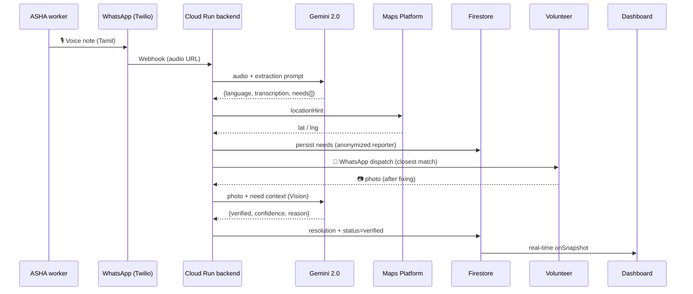

<div align="center">

# SAHAYA · सहाय · சகாயம்

### Voice-first community needs intelligence

**Turning ASHA worker voice notes into NGO action — over WhatsApp.**

[](LICENSE)
[](https://ai.google.dev)
[](https://cloud.google.com/run)
[](https://firebase.google.com)
[](https://nextjs.org)

🏆 Built for **Google Solution Challenge 2026** · GDG on Campus — Coimbatore Institute of Technology

</div>

---

## The problem

India has **1.04 million ASHA workers**¹ — frontline community health activists, mostly women, who walk villages every day and witness 30+ unmet community needs: a child with a rash, a dry tube well, a grandmother who hasn't eaten in two days. Today they can report **2 of those 30**, because the reporting tools are paper forms and English smartphone apps that assume a literacy and digital fluency they may not have.

Meanwhile, NGOs and local-government volunteers sit hours away with skills and willingness to help — but no live signal of what's needed where.

> ¹ National Health Mission, 2024.

## The idea — five ingredients no one else combines

1. **Voice-first.** ASHA workers speak 20-second voice notes in their own language.
2. **WhatsApp-native.** No app to install. Both intake AND dispatch happen on the one app every Indian phone already has.
3. **Multilingual at the model layer.** Tamil, Hindi, English (or code-mix) — Gemini 2.0 handles all of them in a single call.
4. **Closed-loop, with proof.** Volunteers send a "fixed it" photo. Gemini Vision compares it to the reported issue and returns `verified | confidence | reason`.
5. **Public ledger.** A live Google Maps heatmap of every need, every resolution, every photo — readable by any citizen, journalist, or policy maker.

## How it works



## ✨ Highlights

- 🎙️ **Single-API multimodal**: one Gemini 2.0 Flash call does language detection + transcription + structured extraction
- 🛡️ **Privacy-first by design**: phone numbers never leave the private `asha_workers` collection. The public `needs` collection only carries an opaque `publicId` and at most a first name.
- 🇮🇳 **Six Google products** end-to-end: Gemini, Firestore, Cloud Run, Firebase Auth, Firebase Hosting, Google Maps Platform
- 🗺️ **Coimbatore-region demo data**: 47 needs across 5 villages (Pollachi, Sulur, Annur, Mettupalayam, Karamadai) in Tamil/Hindi/English
- ✅ **Closed-loop verification**: every resolved need on the dashboard has a Gemini-verified photo
- 📵 **Zero install**: ASHA workers and volunteers both interact entirely through WhatsApp

## SDG alignment

| Goal | How SAHAYA contributes |
|---|---|
| **SDG 1** No Poverty | Routes food, ration, and shelter needs to the nearest qualified volunteer within hours |
| **SDG 3** Good Health & Well-being | PHC stockouts, antenatal lapses, TB medicine gaps surfaced and dispatched |
| **SDG 5** Gender Equality | The reporter network (ASHA) is 100% women; voice-first removes the literacy barrier |
| **SDG 10** Reduced Inequalities | Public dashboard creates accountability across rural / urban divide |
| **SDG 11** Sustainable Communities | Maps community needs spatially for evidence-based local planning |

[Detailed SDG mapping →](docs/SDG_ALIGNMENT.md)

## Stack

| Layer | Tech | Google? |
|---|---|---|
| AI — voice + vision | **Gemini 2.0 Flash** | ✅ |
| Database | **Cloud Firestore** | ✅ |
| Auth | **Firebase Authentication** | ✅ |
| Photo storage | **Firebase Storage** | ✅ |
| Backend | **Cloud Run** (Node 22 + TypeScript + Express) | ✅ |
| Web hosting | **Firebase Hosting** | ✅ |
| Maps + geocoding | **Google Maps Platform** | ✅ |
| Frontend | Next.js 15 + Tailwind 3 + React 19 | — |
| Messaging | WhatsApp via Twilio | — |

**Six Google products**, all in production-ready posture (security rules, anonymization, IAM bindings, CDN-ready static export).

## Repository layout

```
SAHAYA/
├── backend/                    Cloud Run service
│   └── src/
│       ├── lib/                config, logger, firebase, gemini, twilio, twilioOutbound, maps, storage, geo
│       ├── domain/             types (Zod), repo (CRUD)
│       ├── pipeline/           extractNeeds, geocode, processNeeds, dispatchVolunteer, verifyResolution, volunteerCommands
│       ├── routes/             health, whatsapp, test
│       └── scripts/            seed, seedData (47 needs · 10 volunteers · 5 villages)
├── web/                        Next.js 15 dashboard
│   ├── app/                    layout, page, globals.css
│   ├── components/             HeroStrip, NeedsMap, ActivityFeed, NeedCard, NeedTypeBreakdown
│   ├── lib/                    firebase (web SDK), useNeeds (real-time hook), types
│   └── public/demo.json        Fallback dataset for no-Firebase preview
├── scripts/                    deploy-{backend,firestore,web,all}.sh
├── docs/
│   ├── SETUP.md                Fetch the 4 API keys (~25 min)
│   ├── DEPLOY.md               8-step deployment runbook
│   ├── ARCHITECTURE.md         System flow + design decisions
│   ├── DATA_MODEL.md           Firestore collections + privacy posture
│   ├── SDG_ALIGNMENT.md        Detailed UN SDG mapping
│   ├── VIDEO_SCRIPT.md         3-min demo video shot list + voiceover
│   └── SUBMISSION.md           Hack2Skill submission text
├── firestore.rules             Privacy-first security rules
├── firestore.indexes.json
├── firebase.json
├── LICENSE
└── README.md
```

## Quickstart

### Local dev

```bash
git clone https://github.com/Mithran-MV/SAHAYA.git && cd SAHAYA

# Backend
cd backend
cp .env.example .env             # see docs/SETUP.md for keys
npm install
npm run dev                      # http://localhost:8080

# Web (in another terminal)
cd ../web
cp .env.local.example .env.local
npm install
npm run dev                      # http://localhost:3000
```

The dashboard works without keys — it falls back to `web/public/demo.json` so you can see the UI immediately.

### Seed the demo dataset

```bash
cd backend
npm run seed:wipe                # 47 needs · 10 volunteers · 31 verified resolutions
```

### Deploy

See [docs/DEPLOY.md](docs/DEPLOY.md) for the 8-step end-to-end runbook. TL;DR:

```bash
set -a; source backend/.env; set +a
./scripts/deploy-all.sh          # rules → backend → web
```

## Try the WhatsApp pipeline

After deploying:

1. Join the Twilio sandbox: send `join <code>` to the sandbox number (one-time).
2. Send a voice note in Tamil: *"Ward 4-la oru thatha 2 naal-a saapadala"*
3. SAHAYA replies in seconds with the structured extraction.
4. The dashboard updates live. The closest qualified volunteer gets a WhatsApp dispatch.
5. The volunteer takes a "fixed it" photo and sends it. Gemini Vision verifies. The resolution lands on the public dashboard with the verified photo.

Volunteer commands (over WhatsApp):

```
/v register Arjun
/v skills water,infrastructure,sanitation
/v area Pollachi
/v radius 18
/v ready
/v claim <needId>
/v done <needId>      (then attach photo)
/v status
/v help
```

## Privacy & security posture

- All writes flow through the Cloud Run backend using the Firebase Admin SDK. The browser cannot write to Firestore.
- ASHA worker phone numbers are stored only in `asha_workers` (rules: read/write false from clients).
- Volunteer phone numbers are stored only in `volunteers` (rules: read/write false from clients).
- The public `needs` collection (rules: read=true) carries only an opaque `reporter.publicId` and a first name.
- The Google Maps web key is meant to be restricted by HTTP referrer. The Gemini key lives only on the backend.

## Documentation

- 📘 [Setup guide](docs/SETUP.md) — fetch API keys (~25 min)
- 🚀 [Deployment runbook](docs/DEPLOY.md) — go live on Google Cloud
- 🏛️ [Architecture](docs/ARCHITECTURE.md) — system flow + design decisions
- 🗃️ [Data model](docs/DATA_MODEL.md) — Firestore collections + privacy posture
- 🌍 [SDG alignment](docs/SDG_ALIGNMENT.md) — detailed mapping
- 🎬 [Video script](docs/VIDEO_SCRIPT.md) — 3-min shot list + voiceover
- 📝 [Submission text](docs/SUBMISSION.md) — copy-paste for Hack2Skill

## Status

**Active build for Solution Challenge 2026 submission · April 2026.**

## License

MIT — see [LICENSE](LICENSE).

---

<div align="center">

Built by **Mithran MV** for the GDG on Campus — Coimbatore Institute of Technology community.<br />
With thanks to the ASHA workers of Tamil Nadu, whose voices inspired this project.

</div>
